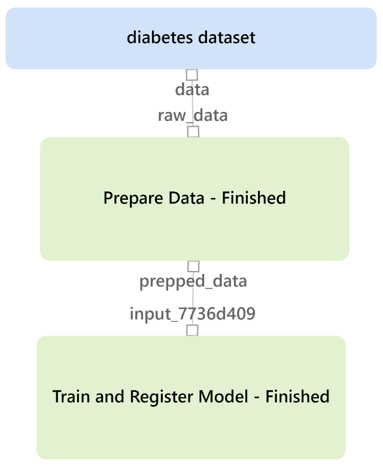
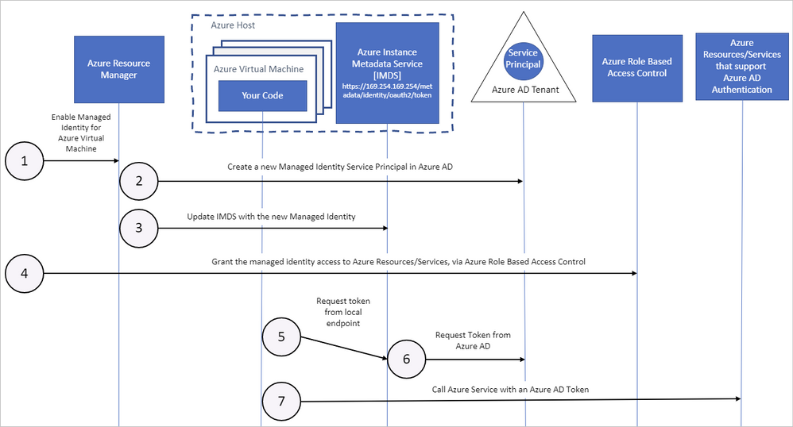

# Azure ML Python SDK Cheat Sheet

This repository is aggregating main functions, methods and ultimately the setup of the Azure ML Python SDK.

Azure ML is a cloud-based service for creating and managing machine learning solutions. It's designed to help data scientists and machine learning engineers leverage their existing data processing and model development skills and frameworks, and scale their workloads to the cloud.

Goal is to work / read through the scripts based on the overview order to get a better understanding of Azure ML Python SDK with as limited docs review needed as possible. 

 

Overview
=====

Scripts are in order of implementation:

1. __Datastores__
    - Upload and registration of training data
    - Main script: [01_datastores.py](./01_datastores.py)
2. __Compute__
    - Creating compute target for model training
    - Main script: [02_compute.py](./02_compute.py)
3. __Environment__
    - Setup of experiment environment and dependencies
    - Main script: [03_envs.py](./03_envs.py)
4. __Experiment__
    - Run single script experiment
    - Main script: [04_experiment.py](./04_experiment.py)
5. __ML Flow__
    - Manage the Machine Learning development lifecycle
    - Main script: [05_mlflow.py](./05_mlflow.py)
6. __Pipeline__
    - Running experiments divided into pipeline steps
    - Main script: [06_pipeline.py](./06_pipeline.py)
7. __Inference__
    - Set up web service and consume for inference
    - Main script: [07_inference.py](./07_inference.py)
8. __Batch pipeline and inference__
    - Setup pipeline and inference for batch processing
    - Main script: [08_batch_pipeline_inference.py](./08_batch_pipeline_inference.py)
9. __Hyperparamenter__
    - Tune and evaluate hyperparameter for model performance
    - Main script: [09_hyperparameter.py](./09_hyperparameter.py)
10. __Automated ML__
    - Run automated Machine Learning experiments for various model testing
    - Main script: [10_automatedML.py](./10_automatedML.py)
11. __Privacy__
    - Explore differential privacy to preserve the privacy of individual data points
    - Main script: [11_privacy.py](./11_privacy.py)
12. __Interpretation__
    - Explain global and local feature importance
    - Main script: [12_interpretation.py](./12_interpretation.py)
13. __Unfairness__
    - Analyze disparity between prediction performance across sensitive feature groups
    - Main script: [13_unfairness.py](./13_unfairness.py)
14. __Monitor model__
    - Monitor telemetry from models on Azure ML
    - Main script: [14_monitor_model.py](./14_monitor_model.py)
15. __Data drift__
    - Capture new data in a dataset and compare to dataset with which model is trained
    - Main script: [15_data_drift.py](./15_data_drift.py)

 

Setup
=====

- Setup Azure ML workspace ([MS ML Quickstart](https://docs.microsoft.com/en-us/azure/machine-learning/quickstart-create-resources))
- Update [./config_template.json](./config_template.json) with your Azure subscription id, resource group and workspace name
    - **ATTENTION!** make sure to rename file to `config.json`
- Update [./template.env](./template.env)
    - **ATTENTION!** make sure to rename file to `.env`
- Run `conda env create -f environment.yml` for Python environment for local development (this might take a while)
- Pipeline steps ("experiments") can be found in [./experiments](./experiments) as detailed below

 

Further Notes
=====

### A) Experiment / Pipeline Steps

* The basic single script experiment of 04. includes some basic data processing and logging as per [./experiments/04_experiment_script.py](./experiments/04_experiment_script.py)
* For MLFlow integration in 05., the single script has been extended as per [./experiments/04_experiment_script_mlflow.py](./experiments/04_experiment_script_mlflow.py)
* The main pipeline of 06. itself includes two steps:
    1. Data preprocessing [./experiments/06_data_prep.py](./experiments/06_data_prep.py) inkl. normalization
    2. Model training [./experiments/06_train_model.py](./experiments/06_train_model.py) for classification using logistic regression
* Finalized Azure ML pipeline ([06_pipeline.py](./06_pipeline.py)) will look like:

*Repository Azure ML pipeline*

* For hyperparameter tuning of 09., the model training has been adepted as per [./experiments/09_parameter_tuning.py](./experiments/09_parameter_tuning.py).
* Interpretation of model as in part 12. has been included in the experiment as per [./experiments/12_interpret_model.py](./experiments/12_interpret_model.py) 

 

### B) Azure Compute Targets

<table>
  <tr>
    <th>Compute target</th>
    <th>Usage</th>
    <th>Description</th>
  </tr>
  <tr>
    <td>Local web service</td>
    <td>Testing / debug</td>
    <td>Good for limited testing and troubleshooting.</td>
  </tr>
  <tr>
    <td>Azure Kubernetes Service (AKS)</td>
    <td>Real-time inference</td>
    <td>Good for high-scale production deployments. Provides autoscaling, and fast response times.</td>
  </tr>
  <tr>
    <td>Azure Container Instances (ACI)</td>
    <td>Testing</td>
    <td>Good for low scale, CPU-based workloads.</td>
  </tr>
  <tr>
    <td>Azure ML Compute Clusters</td>
    <td>Batch inference</td>
    <td>Run batch scoring on serverless compute. Supports normal and low-priority VMs.</td>
  </tr>
  <tr>
    <td>Azure IoT Edge (Preview)</td>
    <td>IoT module</td>
    <td>Deploy & serve ML models on IoT devices.</td>
  </tr>
</table>

*Compute concept in Azure ML*

 

### C) Azure ML Python SDK libraries

Overview of main Azure ML SDK libraries used in this repo.

- __azureml-automl-core__
    - Contains automated machine learning classes for executing runs in Azure ML.
    - Packages: `core`
    - [Microsoft Docs](https://docs.microsoft.com/en-us/python/api/azureml-automl-core/?view=azure-ml-py)
- __azureml-automl-runtime__
    - Contains automated machine learning classes for executing runs and transforming data in Azure ML.
    - Packages: `runtimer`, `transformer`
    - [Microsoft Docs](https://docs.microsoft.com/en-us/python/api/azureml-automl-runtime/?view=azure-ml-py)
- __azureml-core__
    - Contains core packages, modules, and classes for Azure ML: managing compute targets, creating/managing workspaces and experiments, and submitting/accessing model runs and run output/logging.
    - Contains modules supporting data representation for Datastore and Dataset in Azure ML.
    - Contains Azure ML exception classes.
    - Packages: `core`, `data`, `exceptions`, `history`
    - [Microsoft Docs](https://docs.microsoft.com/en-us/python/api/azureml-core/?view=azure-ml-py)
- __azureml-datadrift__
    - Contains functionality to detect when model training data has drifted from its scoring data.
    - Packages: `datadrift`
    - [Microsoft Docs](https://docs.microsoft.com/en-us/python/api/azureml-datadrift/?view=azure-ml-py)
- __azureml-interpret__
    - Contains functionality for working with model interpretability in Azure ML.
    - Packages: `interpret`
    - [Microsoft Docs](https://docs.microsoft.com/en-us/python/api/azureml-interpret/?view=azure-ml-py)
- __azureml-mlflow__
    - Contains functionality integrating Azure ML with MLFlow: open source platform for managing machine learning processes which can also be used to track metrics as an alternative to the native log functionality
    - Packages: `mlflow`
    - [Microsoft Docs](https://docs.microsoft.com/en-us/python/api/azureml-mlflow/?view=azure-ml-py)
- __azureml-pipeline-core__
    - Contains core functionality for Azure ML pipelines, which are configurable machine learning workflows.
    - Packages: `core`
    - [Microsoft Docs](https://docs.microsoft.com/en-us/python/api/azureml-pipeline-core/?view=azure-ml-py)
- __azureml-pipeline-steps__
    - Contains pre-built steps that can be executed in an Azure ML Pipeline.
    - Packages: `steps`
    - [Microsoft Docs](https://docs.microsoft.com/en-us/python/api/azureml-pipeline-steps/?view=azure-ml-py)
- __azureml-train-runtime__
    - Package containing modules providing resources for configuring, managing pipelines, and examining run output for automated machine learning experiments.
    - Packages: `automl`
    - [Microsoft Docs](https://docs.microsoft.com/en-us/python/api/azureml-train-automl-runtime/?view=azure-ml-py)
- __azureml-train-core__
    - Contains estimators used in Deep Neural Network (DNN) training.
    - Contains base estimator classes and the generic estimator class in Azure ML.
    - Contains modules and classes supporting hyperparameter tuning.
    - Contains an estimator for training with Scikit-Learn.
    - Packages: `dnn`, `estimator`, `hyperdrive`
    - Modules: `sklearn`
    - [Microsoft Docs](https://docs.microsoft.com/en-us/python/api/azureml-train-core/?view=azure-ml-py)
- __azureml-widgets__
    - Contains functionality to view the progress of machine learning training runs in Jupyter Notebooks.
    - Packages: `widgets`
    - [Microsoft Docs](https://docs.microsoft.com/en-us/python/api/azureml-widgets/?view=azure-ml-py)

### D) Security Concepts

Azure Role-Based Access Control (Azure RBAC)
- Authorization system that allows fine-grained access management of Azure ML resources
- Roles
    - Owner:
        - Full access to the workspace
        - Ability to view, create, edit, or delete assets in a workspace
        - Change role assignemtns
    - Contributor:
        - View, create, edit, or delete assets in a workspace
        - E.g. create an experiment, create or attach a compute cluster, submit a run, and deploy a web service
    - Reader:
        - Can only perform read-only actions in the workspace
        - Cist and view assets, including datastore credentials in a workspace
        - Can't create or update these assets
- Can be extended by custom roles

System Security
- Azure ML relies on Azure Active Directory (Azure AD) for authentication and/or communication between other Azure cloud resources
- Authentication workflows
    - Service principal
        - Create as service principal account in Azure Active Directory
        - Used to authenticate or obtain an authentication token
		- Commonly used when automated process needs to authenticate to a service
        - Example: continuous integration and deployment script that trains model every time training code changes needs ongoing access --> benefits from a service principal account
    - Azure CLI session
        - Uses active Azure CLI session to authenticate
		- Used during experimentation and iterative development
        - Used when automated processes need to authenticate to service using a pre-authenticated session
        - Log in to Azure via the Azure CLI on local workstation without storing credentials in code or prompting the user to authenticate
    - Managed identity
        - Used when using Azure ML SDK on Azure Virtual Machine
        - Allows VM to connect to workspace without storing credentials in code or prompting the user to authenticate
	    - Azure ML compute clusters can be configured to use a managed identity to access the workspace when training models
        - Provides activity logs so admins can see user activity such as log-in times, when operations were started, and by whom
        - Type: System-assigned
            - Enable a managed identity directly on a service instance
			- Identity is created in Azure AD tied to that service instance's lifecycle
            - Only that Azure resource can use this identity to request tokens from Azure AD
            - When the resource is deleted, Azure automatically deletes the identity
        - Type: User-assigned
            - Managed identity as a standalone Azure resource
            - Can be assigned to one or more instances of an Azure service
			- Identity is managed separately from the resources that use it and persists if a resource using it is removed
- By default, System-assigned identity is enabled directly on the Azure ML compute clusters

*Azure Identity Concept*

 

TODOs
=====
- [x] start with Workspace definiton
- [x] add 'datastore' registration
- [x] add 'compute target' creation
- [x] add 'environment' definition
- [x] add 'pipeline' configuration
- [x] add 'inference' functionality
- [x] add batch processing
- [x] add 'hyperparameter' tuning 
- [x] add 'automated ml' functionality
- [x] add part 'MLflow'
- [x] add part 'differential privacy'
- [x] add part 'interpret models'
- [x] add part 'monitor model'
- [x] add part 'detect unfairness'
- [x] add part 'data drift'
- [x] review and extend azureml function parameter comments
- [] fix datastore access: authentication failed when trying to connect to created datastore
- [] update explanation on 15_data_drift.py
